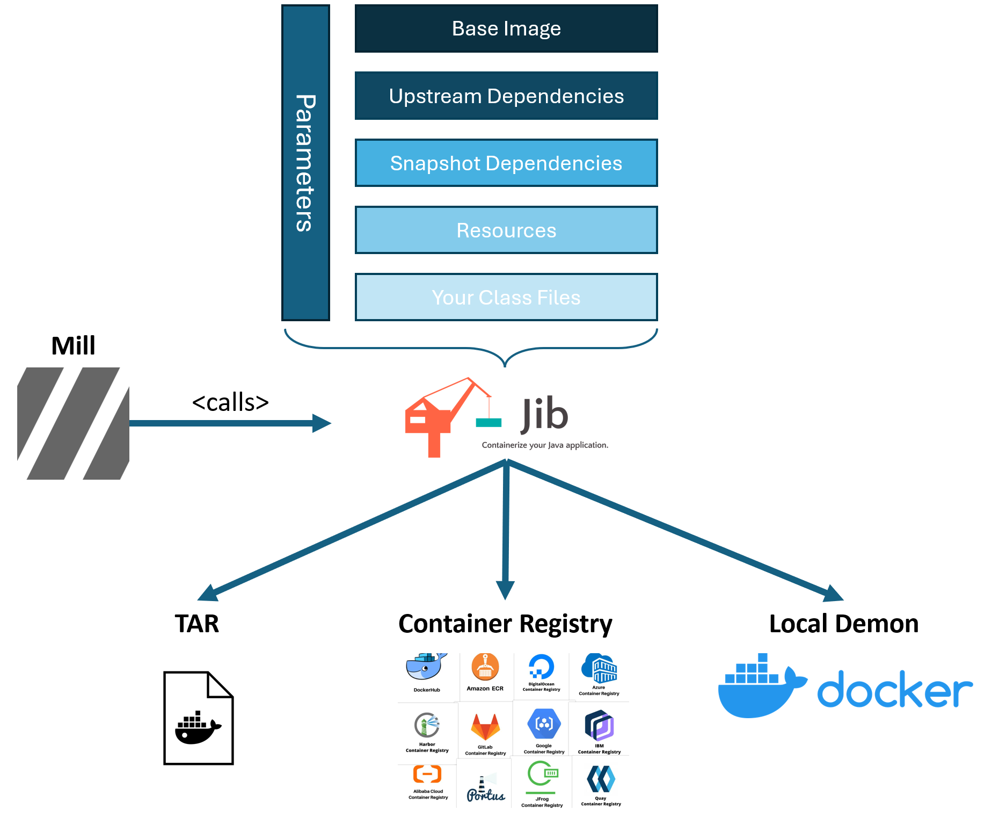
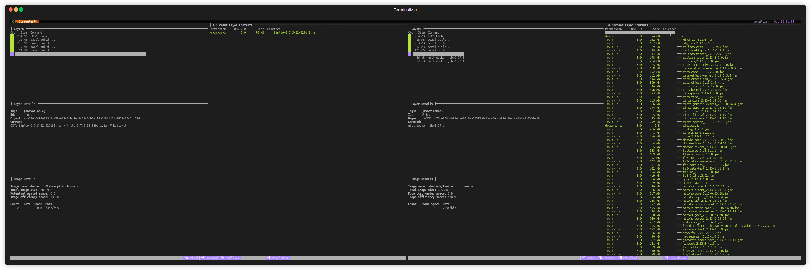
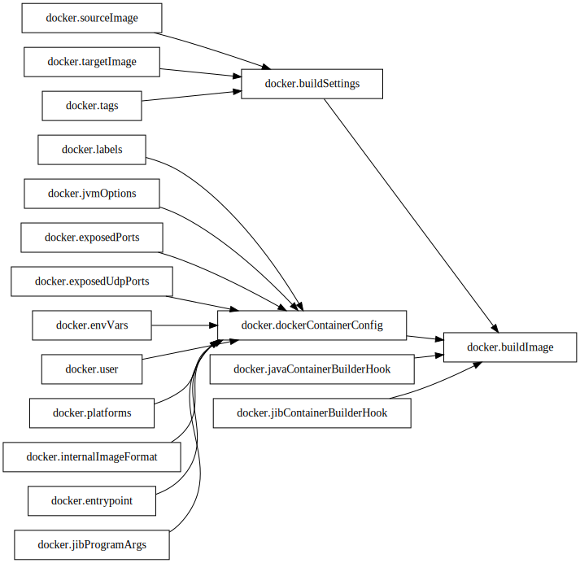
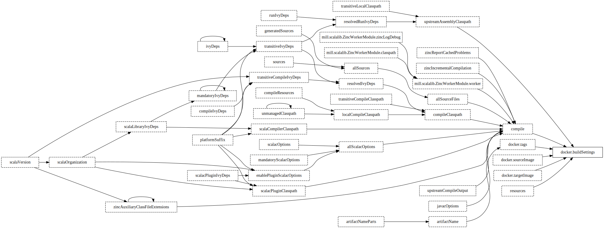
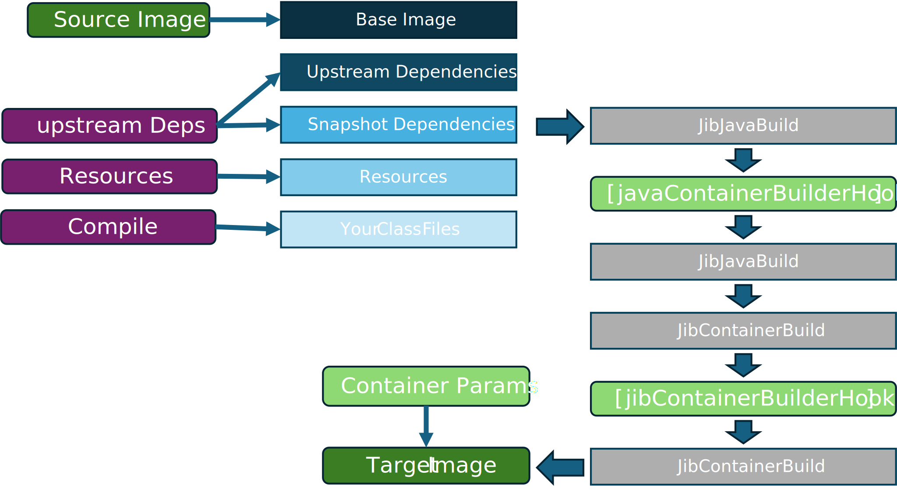

= Mill Docker Jib
:sectnums:
:toc:

== TL:DR 

This is a link:https://mill-build.org/[Mill] Plugin to integrate link:https://github.com/GoogleContainerTools/jib[jib]

* You never heared of Jib and expect to write Dockerfiles - start here: xref:#motivation[Motivation]
* You know what Jib is and want to know how this Plugin is built? xref:#plugin-design[Plugin Design]
* Quick start up times of the container is what you care most? See the excellent existing plugins link:https://mill-build.org/mill/0.12.1/extending/thirdparty-plugins.html#_native_image[Native Image Plugin] and https://mill-build.org/mill/0.12.1/extending/thirdparty-plugins.html#_docker_native_image_packager[Docker Native Image Plugin] 
* I thought this was TL:DR - take me to the code! xref:examples[Examples]

== Motivation

Mill is an excellent build tool for Scala. It comes with "batteries included" and as such already has a link:https://mill-build.org/mill/0.11.12/contrib/docker.html[Docker Plugin].
So how does this Plugin differ from the out of the box Docker Plugin? 

In a nutshell the Mill contrib Docker Plugin is a thin wrapper around the Docker CLI.

image::images/milldocker.png[Mill Contrib Docker, 600, 400]

There are a few reasons why you might want to use Jib instead of writing Dockerfiles:

* Unlike the contrib Docker Plugin, Jib does not require a Docker daemon to be running. This is particularly useful in CI/CD pipelines. 
* By default the Contrib Plugin creates a "fat jar" and puts it as a single layer in the container. As a consequence the whole container needs to be rebuilt if only a single class file changes. 
* Certain use cases are cumbersome to implement with the contrib plugin (e.g. adding a java agent to the JVM) as the link:https://github.com/com-lihaoyi/mill/blob/main/contrib/docker/src/mill/contrib/docker/DockerModule.scala[build step] cannot be easily customized. As its just a thin wrapper it can easily be replaced with your own build step - but that was the trigger for creating this plugin.

For a detailed introduction to Jib I recommend the following talks:

[cols="2*"]
|===
a|
image:https://img.youtube.com/vi/H6gR_Cv4yWI/maxresdefault.jpg[link=https://www.youtube.com/watch?v=H6gR_Cv4yWI, 500, 200]
a|
image:https://img.youtube.com/vi/oXS1rS6v0I8/maxresdefault.jpg[link=https://www.youtube.com/watch?v=oXS1rS6v0I8, 500, 200]
|===

In short Jib:

* Jib allows you to split your application into multiple layers. This allows for more incremental builds and faster deployments which is very much in the link:https://mill-build.org/mill/0.11.12/Mill_Design_Principles.html["spirit" of Mill]. This allows for faster deployments and more incremental builds as you only need to rebuild the layer that changed. (e.g. only your application code without its  dependencies).
* Jib can pull, build and deploy directy to and from a container registry without the need for a Docker daemon.

== In Action

This is a terminal recording of the plugin in action - using the link:https://github.com/wagoodman/dive[dive] tool it compares the images created by the contrib Docker Plugin on the left and the Jib Plugin on the right.
The example uses link:https://github.com/LaurenceWarne/libro-finito[libro-finito] as a case study.
As you can see the Jib Plugin separates the major size contributors into separate layers. This allows for more incremental builds and faster deployments.

== Plugin Design 

The plugin task graph looks like this:

The leaf nodes are the settings that can be modified by the user and are described here in detail:  xref:#plugin-configuration[Plugin Configuration].
The BuildSettings tasks pulls the output of the JavaBuild Module to then create the appropriate layers.
The various input tasks can be seen in the following graph:

In terms of execution the next graph shows the high level flow of the plugin
The source Image is pulled and used as Base Layer. 
The artifacts from various JavaModule tasks are used to fill the other layers. 
The layers are used as input for a link:http://www.javadoc.io/page/com.google.cloud.tools/jib-core/latest/com/google/cloud/tools/jib/api/JavaContainerBuilder.html[Java Container Builder].

The optional user provided javaContainerBuilderHook can be used to customize the link:http://www.javadoc.io/page/com.google.cloud.tools/jib-core/latest/com/google/cloud/tools/jib/api/JibContainerBuilder.html[Jib Container Builder].
For even more customization the user can provide a custom JibContainerBuilder which allows to freely modify/discard and add layers to the default layers created in the previous steps.

Finally the container is built using the user provided container parameters and pushed to the according target image format (Container Registry, Docker Daemon, Tarball).

== Plugin Configuration

[cols="1,1,1,1", options="header"]
|===
|Parameter |Type |Description |Required

|sourceImage
|com.ofenbeck.mill.docker.JibSourceImage
|Source image for the container.
|X

|targetImage
|com.ofenbeck.mill.docker.ImageReference
|Target image for the container.
|X

|labels
|Map[String, String]
|Labels to add to the Docker image.
|

|tags
|Seq[String]
|Tags to add to the Docker image.
|

|jvmOptions
|Seq[String]
|JVM runtime options for the container.
|

|exposedPorts
|Seq[Int]
|TCP ports the container will listen to at runtime.
|

|exposedUdpPorts
|Seq[Int]
|UDP ports the container will listen to at runtime.
|

|envVars
|Map[String, String]
|Environment variables for the container.
|

|user
|Option[String]
|User and group to run the container as.
|

|platforms
|Set[md.Platform]
|Target platforms for the container.
|

|internalImageFormat
|md.JibImageFormat
|Internal image format to use.
|

|entrypoint
|Seq[String]
|Entrypoint command for the container.
|

|jibProgramArgs
|Seq[String]
|Program arguments for the container.
|

|jibContainerBuilderHook
|Option[(JibContainerBuilder, Vector[FileEntriesLayer], Vector[String]) => JibContainerBuilder]
|Hook to modify the JibContainerBuilder before building the container.
|

|javaContainerBuilderHook
|Option[JavaContainerBuilder => JavaContainerBuilder]
|Hook to modify the JavaContainerBuilder before building the container.
|
|===

== Examples

All examples are at the same time integration tests and can be found in the link:mill-docker/test/resources[itest/src] folder.
Be aware that the examples include the plugin through a test specific mechanism.

If you want to ues the code outside replace accordingly.

=== All possible input / output image types 

See all possible input/output combinations link:mill-docker/test/resources/examples-imagetypes[here].

=== Simple Input Configuration Example

An example of standard settings you might wanna modify link:mill-docker/test/resources/examples-buildsettings[here]

=== Java Container Builder Hook Example

An example modifying the Java Container Builder link:mill-docker/test/resources/examples-jvmagent[here]

=== Jib Container Builder Hook Example

An example modifying the Jib Container Builder link:mill-docker/test/resources/examples-customjibbuild[here]

=== Future Work

* Jlink support for smaller images 
* Better support for multi module projects (right now the plugin treats them as upstream dependencies - which is not always what you want)
* Native Image use case investigation
